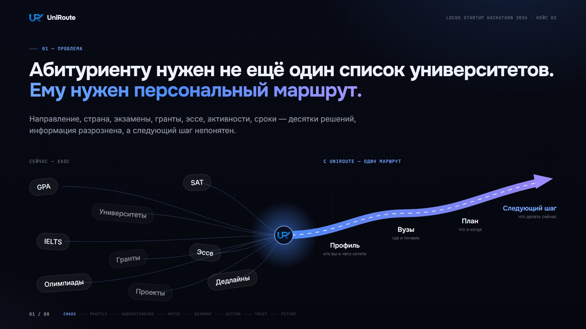
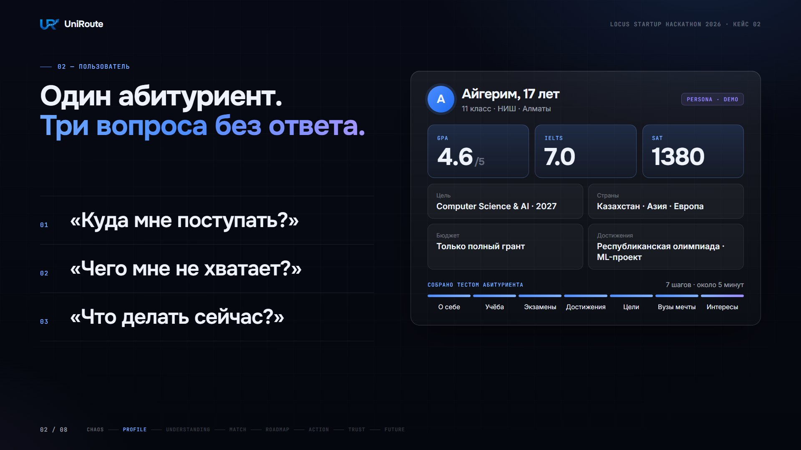
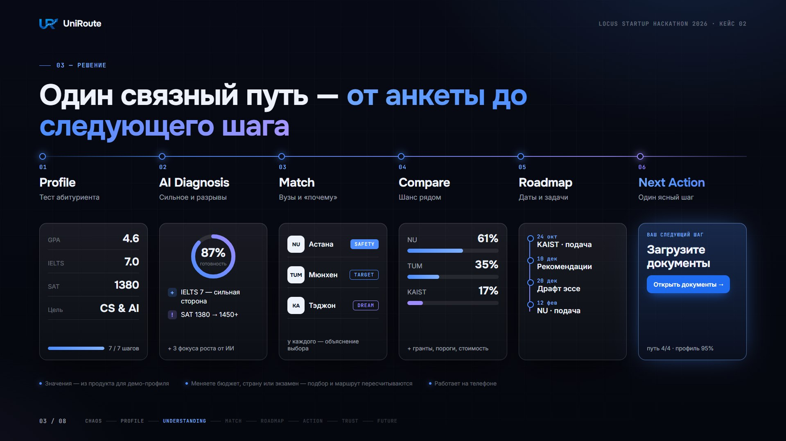
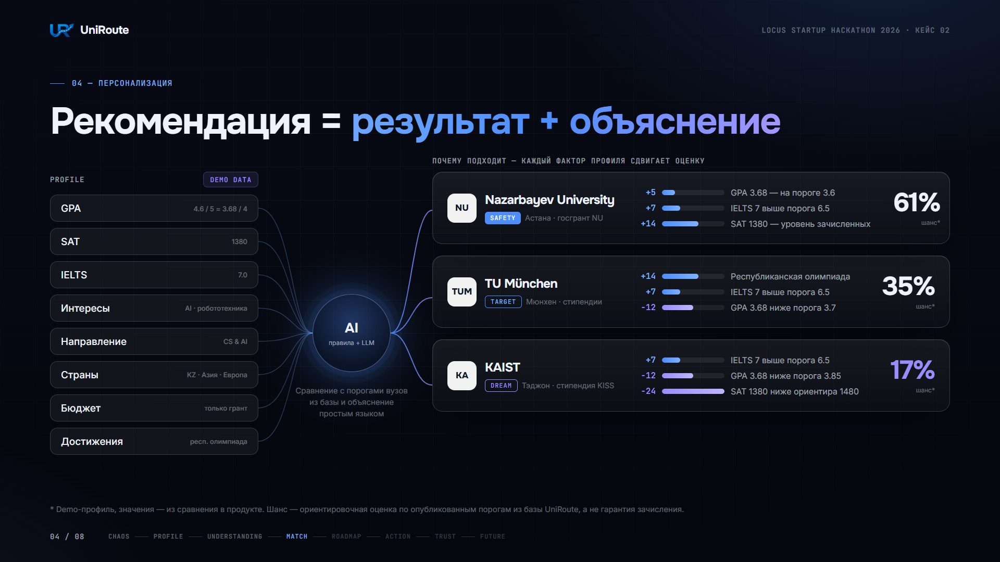
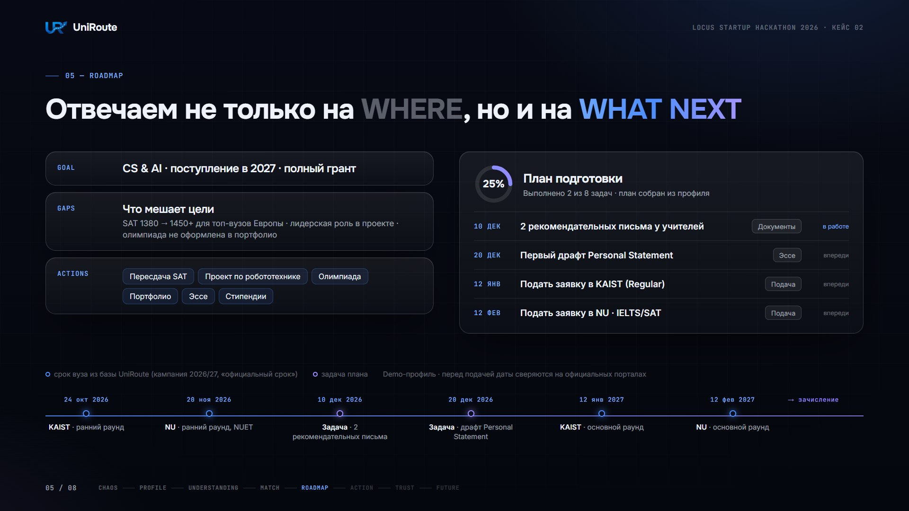
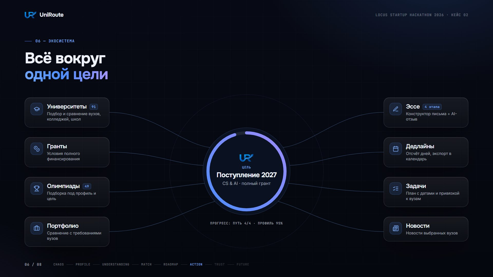
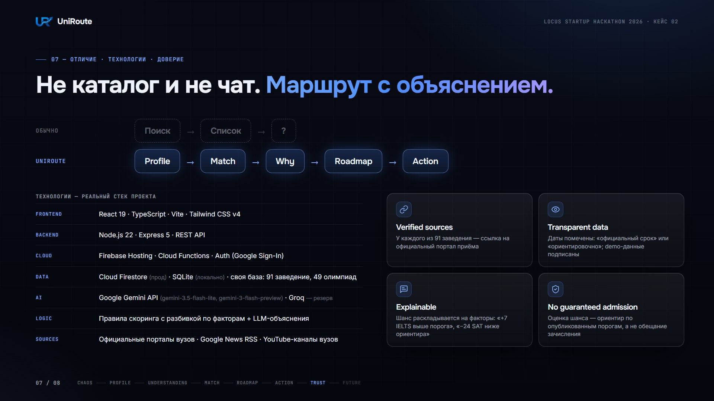
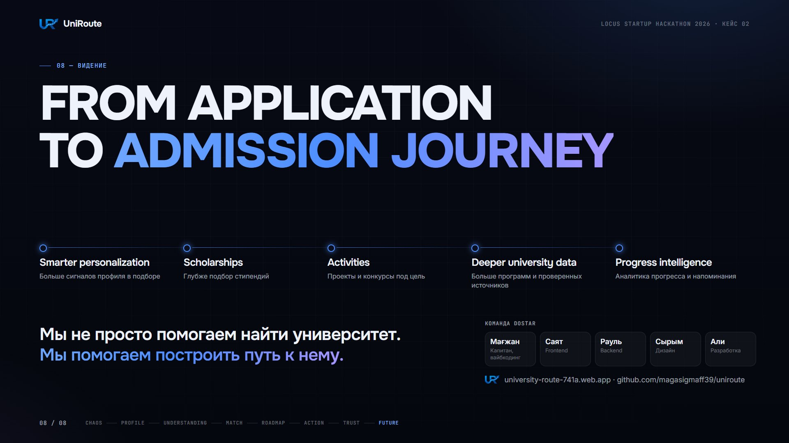

# UniRoute — презентация

LOCUS Startup Hackathon 2026 · Кейс 02 «Персональный маршрут поступления» · команда **DoStar**

8 слайдов. PDF-версия: [скачать UniRoute_LOCUS_2026_Case02.pdf](https://github.com/magasigmaff39/uniroute/raw/main/docs/UniRoute_LOCUS_2026_Case02.pdf).

Значения на слайдах 2–5 посчитаны продуктом для демо-профиля и подписаны как demo. Шанс — ориентировочная оценка, а не гарантия зачисления.

### 1. Проблема

### 2. Пользователь

### 3. Решение: путь от анкеты до следующего шага

### 4. Персонализация: рекомендация и объяснение

### 5. Roadmap

### 6. Экосистема

### 7. Отличие, технологии, доверие

### 8. Видение и команда

---

[← README](../README.md) · [Техническая справка](../TECHNICAL_BRIEF.md)
